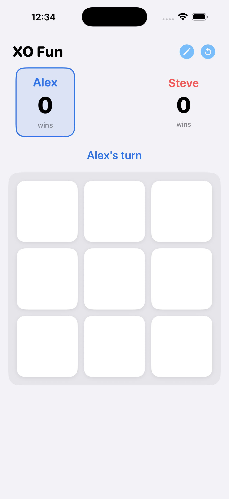
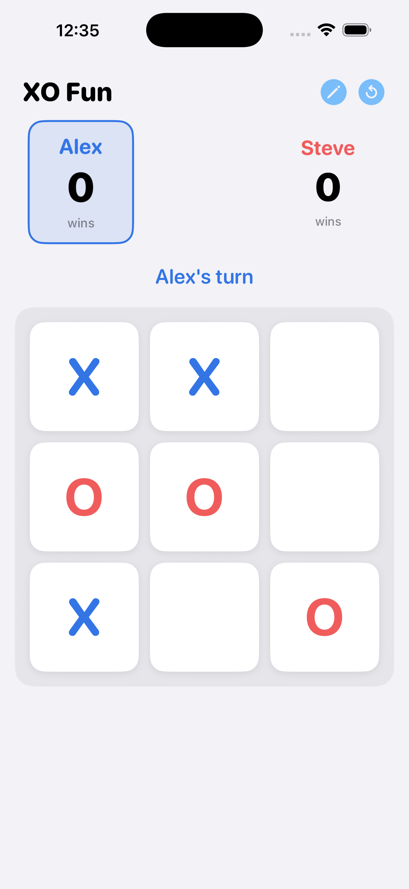
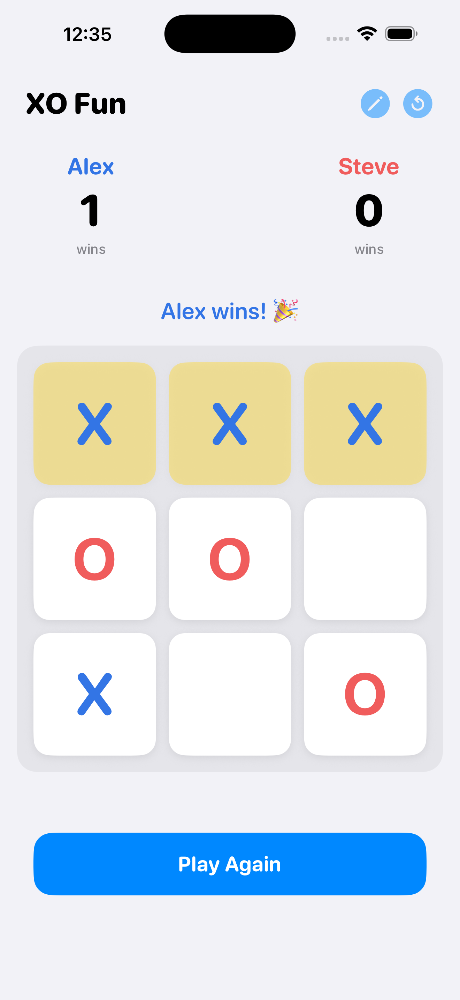
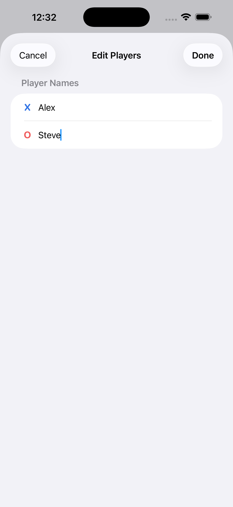

# XO Fun — Tic Tac Toe

A clean, calm Tic Tac Toe app for kids and families. Two players, one device — no accounts, no internet, nothing to learn.

<p align="center">
  
  
  
  
</p>

## Features

- Pass-and-play — hand the phone back and forth, no setup required
- Custom player names
- Score tracker that carries over between rounds
- Alternates who goes first each round
- Soft colors, no animations, no sound — calm enough for kids
- Portrait only, iOS 16+
- AdMob banner ad (child-directed / COPPA compliant)

## Tech Stack

- Swift / SwiftUI
- [XcodeGen](https://github.com/yonaskolb/XcodeGen) — project file is generated from `project.yml`
- Google Mobile Ads SDK (AdMob)
- iOS 16+ deployment target

## Getting Started

**Prerequisites:** Xcode 15+, [XcodeGen](https://github.com/yonaskolb/XcodeGen) (`brew install xcodegen`)

```bash
git clone https://github.com/llamakid/xo-fun.git
cd xo-fun
xcodegen generate
open TicTacToe.xcodeproj
```

Then select an iPhone simulator and hit Run.

> **Ad testing:** real ads don't serve on the simulator. Swap the ad unit ID in `AdBannerView.swift` to `ca-app-pub-3940256099942544/2934735716` (Google's test ID) while developing.

## Project Structure

```
TicTacToe/Sources/
  App/          TicTacToeApp.swift, Theme.swift
  Game/         GameModel.swift (all game logic)
  Views/        ContentView, BoardView, CellView, ScoreView, StatusView, PlayerNamesSheet
  Ads/          AdBannerView.swift
```

All game logic lives in `GameModel` (an `ObservableObject`). Views are read-only — they call `game.tap(cell:)`, `game.reset()`, or `game.resetAll()` and re-render from published state.

## Building from the Command Line

```bash
xcodegen generate
xcodebuild -project TicTacToe.xcodeproj \
           -scheme TicTacToe \
           -destination 'platform=iOS Simulator,name=iPhone 17,OS=26.2' \
           build
```

## Privacy

Privacy policy: https://www.llamakid.com/privacy/xo-fun-app

The app collects no user data directly. AdMob may collect data as described in Google's privacy policy; COPPA child-directed treatment is enabled.

## License

MIT — see [LICENSE](LICENSE).
